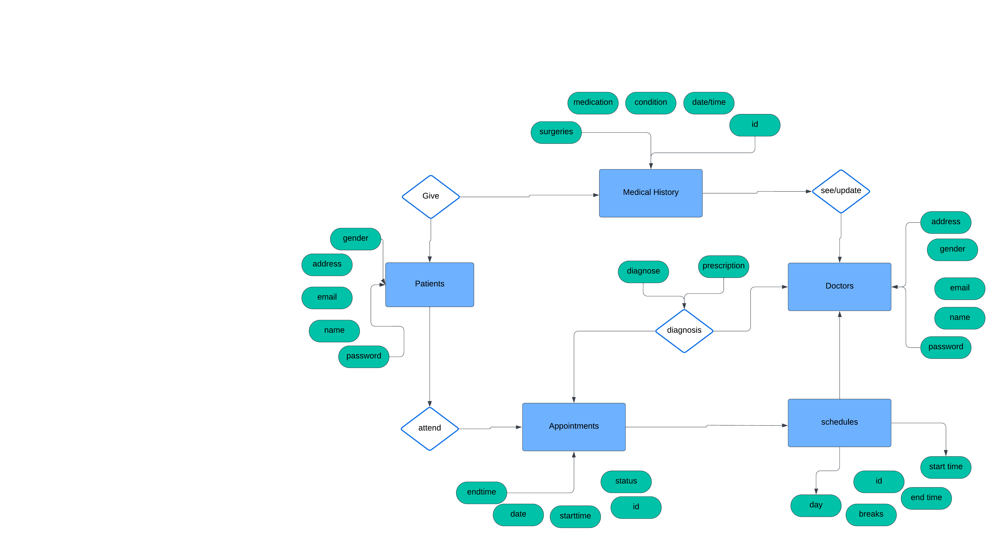

# Hospital Management System - DBMS

## Project Overview

The Hospital Management System (HMS) is a comprehensive solution designed to manage the daily operations of a hospital or clinic. This system is built using modern web technologies to ensure a seamless user experience for both patients and healthcare providers. The HMS offers functionalities for appointment scheduling, patient history management, and streamlined communication between doctors and patients, ensuring efficient and confidential handling of medical information.

## Technologies Used

This project leverages the following technologies:

- **Backend:** Node.js, Express.js
- **Database:** postgreSQL

## System Architecture

### ER Diagram

The Entity-Relationship (ER) diagram illustrates the relationships between the different entities in the system, such as Patients, Doctors, Appointments, and Medical Records.



## Features

### Patient Side Features

- **Dedicated Interface:** Patients have access to a separate, user-friendly interface with individual login credentials.
- **Appointment Management:** Patients can easily book, view, update, or cancel their appointments.
- **Medical History:** Patients can provide and view their previous medical history, ensuring accurate records.
- **Conflict-Free Scheduling:** The system ensures that appointment slots are managed without conflicts, automatically updating availability upon cancellations.
- **Access to Records:** Patients can view their complete medical history, diagnoses, and prescriptions. However, this information is only accessible by the doctor they have an appointment with, ensuring privacy.

### Doctor Side Features

- **Dedicated Interface:** Doctors also have a specialized interface with secure login.
- **Schedule Management:** The system integrates the doctor’s schedule, preventing double-booking and respecting breaks.
- **Patient Information Access:** Doctors can access patient profiles, view medical histories, and update records as needed.
- **Diagnosis and Prescription:** Doctors can provide and modify diagnoses and prescriptions directly through the system.

## Getting Started

### Prerequisites

Ensure you have the following installed on your local development environment:

- Node.js (version 14.x or higher)
- MySQL 
- npm (Node Package Manager)

### Installation and Setup

1. **Clone the repository:**
    ```bash
    git clone 
    ```
2. **Install Dependencies:**
   - Navigate to both the frontend and backend directories and run:
     ```bash
     npm install
     ```

3. **Database Setup:**
   - Create a MySQL database and import the provided schema.
   - Update the database configuration in the backend’s configuration files.

4. **Run the Application:**
   - Start the backend server:
     ```bash
     npm start
     ```
   - Start the frontend development server:
     ```bash
     npm start
     ```
